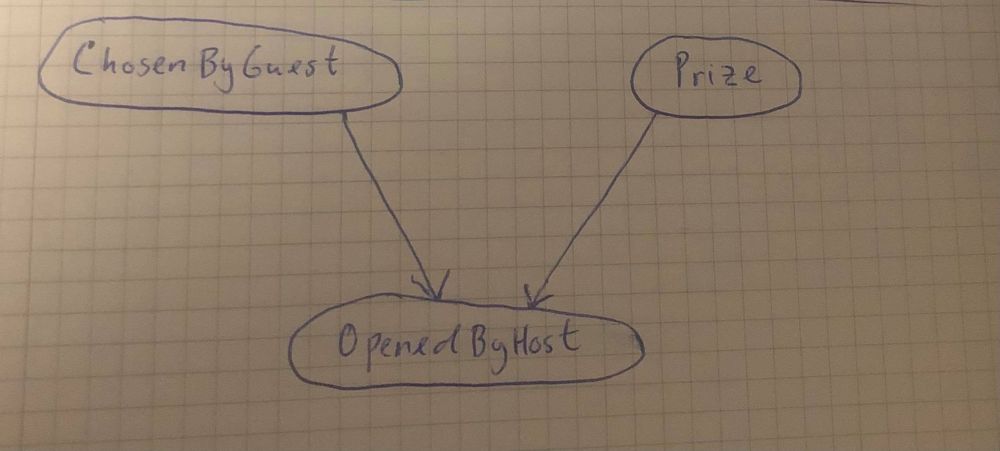

$\newcommand{\indep}{\perp \!\!\! \perp}$
# TDT4171 - Artificial Intelligence Methods
## Uncertainty, Bayesian networks
### Exercise 1
#### Problem 1
__a)__ Having at most 2 siblings is equivalent of having 0, 1, or 2 siblings. Let the random variable $X$ denote the number of siblings. Using the addition rule, we get that the probability of a child having at most 2 siblings is
$$\begin{aligned}
P(X\leq2)&=\sum_{x=0}^2{P(X=x)}\\
&=0.15+0.49+0.27\\
&=\underline{\underline{0.91}}.
\end{aligned}$$
__b)__ Using the formula for conditional probability, the probability that a child has more than 2 siblings given that he has at least 1 sibling is
$$P(X>2|X\geq1)=\frac{P(X>2\wedge X\geq1)}{P(X\geq 1)}.$$
The intersection between $X>2$ and $X\geq1$ is $X>2$, so
$$\begin{aligned}
P(X>2\wedge X\geq1)&=P(X>2)\\
&=\left(\sum_{x=3}^4{P(X=x)}\right)+P(X\geq5)\\
&=0.06+0.02+0.01\\
&=0.09.
\end{aligned}$$
Further we have that
$$\begin{aligned}
P(X\geq1)&=\left(\sum_{x=1}^4{P(X=x)}\right)+P(X\geq5)\\
&=0.49+0.27+0.06+0.02+0.01\\
&=0.85.
\end{aligned}$$
Finally,
$$\begin{aligned}
P(X>2|X\geq1)&=\frac{P(X>2\wedge X\geq1)}{P(X\geq 1)}\\
&=\frac{0.09}{0.85}\\
&=\underline{\underline{\frac{9}{85}}}.
\end{aligned}$$
__c)__ To determine the probability that the friends combined have theee siblings, we have to consider all the combinations that give three siblings.
* Every friend has one sibling, so a total of 3 siblings:
$$P(X=1)^3.$$
* Only one of the friends have three siblings, the rest have zero siblings. Since there are three friends, this could happen in three ways:
$$3\cdot P(X=0)^2\cdot P(X=3).$$
* The first friend has zero siblings, the second friend has 1 sibling, and the third friend have 2 siblings. The number of combinations are $3! =6$:
$$6\cdot P(X=0)\cdot P(X=1)\cdot P(X=2).$$

The probability that the friends combined have theee siblings is:
$$\begin{aligned}
P(X=1)^3+3\cdot P(X=0)^2\cdot P(X=3)+6\cdot P(X=0)\cdot P(X=1)\cdot P(X=2)&=0.49^3+3\cdot0.15^2\cdot0.06+6\cdot0.15\cdot0.49\cdot0.27\\
&=0.240769\\
&\approx\underline{\underline{0.24}}.
\end{aligned}$$
__d)__ Let $E$ and $J$ denote the number of siblings Emma and Jacob have, respectively. We know that $E+J=3$. Using Bayes' Rule, the probability of Emma having no siblings is:
$$P(E=0|E+J=3)=\frac{P(E+J=3|E=0)\cdot P(E=0)}{P(E+J=3)}.$$
$E+J=3$ given that $E=0$ implies that $J=3$. So
$$P(E+J=3|E=0)=P(J=3)=0.06.$$
Emma and Jacob can have three siblings combined in the following ways:
* One of the friends have zero siblings, the other has three. 2 combinations:
$$2\cdot P(X=0)\cdot P(X=3).$$
* One of the friends have one sibling, the other has three. 2 combinations:
$$2\cdot P(X=1)\cdot P(X=2).$$

We get
$$\begin{aligned}
P(E+J=3)&=2\cdot P(X=0)\cdot P(X=3)+2\cdot P(X=1)\cdot P(X=2)\\
&=2\cdot0.15\cdot0.06+2\cdot0.49\cdot0.27\\
&=0.2826.
\end{aligned}$$
Finally,
$$\begin{aligned}
P(E=0|E+J=3)&=\frac{P(E+J=3|E=0)\cdot P(E=0)}{P(E+J=3)}\\
&=\frac{0.06\cdot0.15}{0.2826}\\
&=\underline{\underline{\frac{5}{157}}}.
\end{aligned}$$
#### Problem 2
__a)__ There are 9 variables in the network, and since each variable has a Boolean state, then the Bayesian network can be represented with $2^9=512\ne18$. The statement is __False__.

__b)__ I will use $d$-separation to solve this task. There are 2 paths from $A$ to $G$:
$$\begin{array}{cc}
A\rightarrow C\rightarrow E\leftarrow D\leftarrow H\rightarrow G \\
A\rightarrow C\rightarrow E\rightarrow F\leftarrow G
\end{array}$$
__First path:__
* $A\rightarrow C\rightarrow E$ is a causal chain where $C$ is unobserved, so this triple is active.
* $C\rightarrow E\leftarrow D$ is a common effect where $E$ is unobserved, so this triple is inactive.
* Hence the whole path is inactive.

__Second path:__
* $A\rightarrow C\rightarrow E$ is a causal chain where $C$ is unobserved, so this triple is active.
* $C\rightarrow E\rightarrow F$ is a causal chain where $E$ is unobserved, so this triple is active.
* $E\rightarrow F\leftarrow G$ is a common effect where $F$ is unobserved, so this triple is inactive.
* Hence the whole path is inactive.

Since both paths are inactive, then $G\indep A$ is __True__.

__c)__ I will use $d$-separation to solve this task. There are 2 paths from $E$ to $H$:
$$\begin{array}{cc}
E\rightarrow F\leftarrow G\leftarrow H\\
E\leftarrow D\leftarrow H
\end{array}$$
__First path:__
* $E\rightarrow F\leftarrow G$ is a common effect where $F$ is unobserved, so this triple is inactive.
* Hence the whole path is inactive.

__Second path:__
* $E\leftarrow D\leftarrow H$ is a causal chain where $D$ is observed, so this triple is inactive.
* Hence the whole path is inactive.

Since both paths are inactive, then $E\indep H|\{D,G\}$ is __True__.

__d)__ I will use $d$-separation to solve this task.
$$\begin{array}{cc}
E\rightarrow F\leftarrow G\leftarrow H\\
E\leftarrow D\leftarrow H
\end{array}$$
__First path:__
* $E\rightarrow F\leftarrow G$ is a common effect where $F$ is observed, so this triple is active.
* $F\leftarrow G\leftarrow H$ is a causal chain where $G$ is unobserved, so this triple is active
* Hence the whole path is active.

Since one path is active, then $E\indep H|\{C,D,F\}$ is __False__.
#### Problem 3
__a)__ To find $P(b)$, I will use marginalization:
$$\begin{aligned}
P(b)&=\sum_{a}{P(b|a)\cdot P(a)}\\
&=P(b|a)\cdot P(a)+P(b|\neg a)\cdot P(\neg a)\\
&=0.5\cdot0.8+0.2\cdot0.2\\
&=\underline{\underline{0.44}}
\end{aligned}$$
__b)__ To find $P(d)$, I will use marginalization:
$$\begin{aligned}
P(d)&=\sum_{b}{P(d|b)\cdot P(b)}\\
&=P(d|b)\cdot P(b)+P(d|\neg b)\cdot P(\neg b)\\
&=0.6\cdot0.44+0.8\cdot\left(1-0.44\right)\\
&=\underline{\underline{0.712}}
\end{aligned}$$
__c)__ Bayes' Rule:
$$P(c|\neg d)=\frac{P(c,\neg d)}{P(\neg d)}$$
Calculating $P(c,\neg d)$ by using marginalization:
$$\begin{aligned}
P(c,\neg d)&=\sum_{b}{P(c,\neg d,b)}\\
&=\sum_{b}{P(c,\neg d|b)\cdot P(b)}\\
&=\sum_{b}{P(c|b)\cdot P(\neg d|b)\cdot P(b)}\\
&=P(c|b)\cdot P(\neg d|b)\cdot P(b)+P(c|\neg b)\cdot P(\neg d|\neg b)\cdot P(\neg b)\\
&=0.1\cdot0.4\cdot0.44+0.3\cdot0.2\cdot(1-0.44)\\
&=0.0512
\end{aligned}$$
We get:
$$\begin{aligned}
P(c|\neg d)&=\frac{P(c,\neg d)}{P(\neg d)}\\
&=\frac{0.0512}{1-0.712}\\
&=\underline{\underline{\frac{8}{45}}}
\end{aligned}$$
__d)__ Bayes' Rule:
$$P(a|\neg c,d)=\frac{P(a,\neg c,d)}{P(\neg c, d)}$$
Calculating $P(a,\neg c,d)$ by using marginalization:
$$\begin{aligned}
P(a,\neg c,d)&=\sum_{b}{P(a,\neg c,d,b)}\\
&=P(a)\sum_{b}{P(b|a)\cdot P(\neg c|b)\cdot P(d|b)}\\
&=P(a)\left(P(b|a)\cdot P(\neg c|b)\cdot P(d|b)+P(\neg b|a)\cdot P(\neg c|\neg b)\cdot P(d|\neg b)\right)\\
&=0.8\left(0.5\cdot0.9\cdot0.6+0.5\cdot0.7\cdot0.8\right)\\
&=0.44
\end{aligned}$$
Calculating $P(\neg c,d)$ by using marginalization:
$$\begin{aligned}
P(\neg c,d)&=\sum_{b}{P(\neg c,d,b)}\\
&=\sum_{b}{P(\neg c,d|b)\cdot P(b)}\\
&=\sum_{b}{P(\neg c|b)\cdot P(d|b)\cdot P(b)}\\
&=P(\neg c|b)\cdot P(d|b)\cdot P(b)+P(\neg c|\neg b)\cdot P(d|\neg b)\cdot P(\neg b)\\
&=0.9\cdot0.6\cdot0.44+0.7\cdot0.8\cdot(1-0.44)\\
&=0.5512
\end{aligned}$$
We get:
$$\begin{aligned}
P(a|\neg c,d)&=\frac{P(a,\neg c,d)}{P(\neg c, d)}\\
&=\frac{0.44}{0.5512}\\
&=\underline{\underline{\frac{550}{689}}}
\end{aligned}$$
#### Problem 4
__a)__ Look at [Exercise-1.py](Exercise-1.py).

__b)__ Look at [Exercise-1.py](Exercise-1.py).

__c)__ 
__A drawing of the Bayesian network:__

__Conditional probability tables:__
| ChosenByGuest   |       Probability |
 |    ---        |      ---   |
|    $P(ChosenByGuest=1)$            |     $\frac{1}{3}$       |
|    $P(ChosenByGuest=2)$            |     $\frac{1}{3}$       |
|    $P(ChosenByGuest=3)$            |     $\frac{1}{3}$       |

| Prize   |       Probability |
 |    ---        |      ---   |
|    $P(Prize=1)$            |     $\frac{1}{3}$       |
|    $P(Prize=2)$            |     $\frac{1}{3}$       |
|    $P(Prize=3)$            |     $\frac{1}{3}$       |

|          |                   | $OpenedByHost=1$ | $OpenedByHost=2$ | $OpenedByHost=3$
---       | ---               | ---              | ---              | ---
$Prize=1$ | $ChosenByGuest=1$ | 0                | $\frac{1}{2}$    | $\frac{1}{2}$
$Prize=2$ | $ChosenByGuest=1$ | 0                | 0                | 1
$Prize=3$ | $ChosenByGuest=1$ | 0                | 1                | 0
$Prize=1$ | $ChosenByGuest=2$ | 0                | 0                | 1
$Prize=2$ | $ChosenByGuest=2$ | $\frac{1}{2}$    | 0                | $\frac{1}{2}$
$Prize=3$ | $ChosenByGuest=2$ | 1                | 0                | 0
$Prize=1$ | $ChosenByGuest=3$ | 0                | 1                | 0
$Prize=2$ | $ChosenByGuest=3$ | 1                | 0                | 0
$Prize=3$ | $ChosenByGuest=3$ | $\frac{1}{2}$    | $\frac{1}{2}$    | 0
__The calculated posterior probabilities:__
| Probabilities |
| --- |
| $P(Prize=1\vert ChosenByGuest=1,OpenedByHost=3)=\frac{1}{3}$ |
| $P(Prize=2\vert ChosenByGuest=1,OpenedByHost=3)=\frac{2}{3}$ |
| $P(Prize=3\vert ChosenByGuest=1,OpenedByHost=3)=0$ |

It is to my advantage to switch my choice.