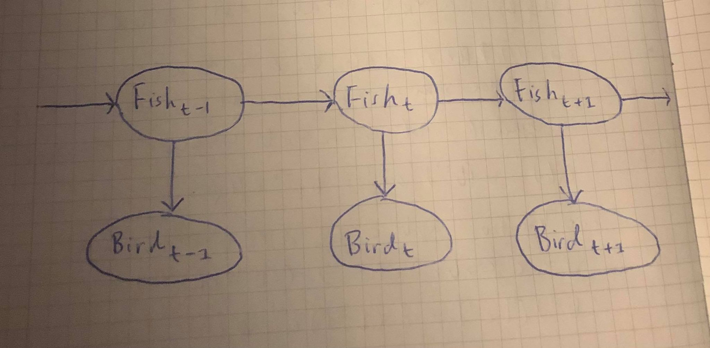
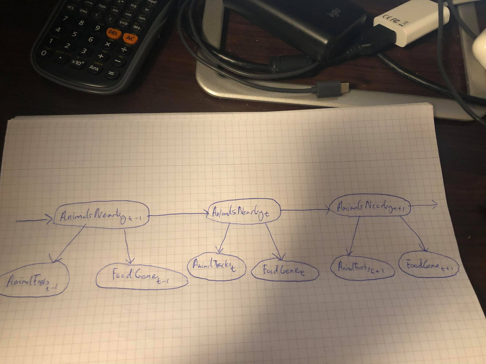

# TDT4171 - Artificial Intelligence Methods
## Assignment 2 - Probabilistic Reasoning over Time
### Problem 1
__a)__ Formulating the problem given in the problem as a hidden Markov model:

**The complete probability tables for the model:**
| $\text{Fish}_{t-1}$ | $P(\text{Fish}_t)$ |
| --------- | -------- |
| $t$       | $0.8$    |
| $f$       | $0.3$    |

| $\text{Fish}_t$ | $P(\text{Bird}_t)$ |
| ----- | -------- |
| $t$   | $0.75$   |
| $f$   | $0.2$    |

__b)__ Output from [assignment2.py](assignment2.py) after calculating
$$\mathbf{P}\left(X_t|\mathbf{e}_{1:t}\right),\quad\text{for}\quad t=1,\dots,6\tag{1}$$
```{sh}
Problem 1b)
Calculating P(X_t|e_1:t) for t = 1,...,6:
P(X_1|e_1:1) = [0.78947368 0.21052632]
P(X_2|e_1:2) = [0.86799277 0.13200723]
P(X_3|e_1:3) = [0.38966879 0.61033121]
P(X_4|e_1:4) = [0.74935019 0.25064981]
P(X_5|e_1:5) = [0.33650851 0.66349149]
P(X_6|e_1:6) = [0.72719639 0.27280361]
```
This operation is __filtering__ because we are calculating $\mathbf{P}(X_t|\mathbf{e}_{1:t})$ for every observation in our evidence vector. Filtering gives us the belief state of a rational agent. In this example, filtering will give us the probabilities for if we are going to find fish at day $t$ given the evidence up until day $t$.

__c)__ Output from [assignment2.py](assignment2.py) after calculating
$$\mathbf{P}\left(X_t|\mathbf{e}_{1:6}\right),\quad\text{for}\quad t=7,\dots,30\tag{2}$$
```{sh}
Calculating P(X_t|e_1:6) for t = 7,...,30:
P(X_7|e_1:6) = [0.66359819 0.33640181]
P(X_8|e_1:6) = [0.6317991 0.3682009]
P(X_9|e_1:6) = [0.61589955 0.38410045]
P(X_10|e_1:6) = [0.60794977 0.39205023]
P(X_11|e_1:6) = [0.60397489 0.39602511]
P(X_12|e_1:6) = [0.60198744 0.39801256]
P(X_13|e_1:6) = [0.60099372 0.39900628]
P(X_14|e_1:6) = [0.60049686 0.39950314]
P(X_15|e_1:6) = [0.60024843 0.39975157]
P(X_16|e_1:6) = [0.60012422 0.39987578]
P(X_17|e_1:6) = [0.60006211 0.39993789]
P(X_18|e_1:6) = [0.60003105 0.39996895]
P(X_19|e_1:6) = [0.60001553 0.39998447]
P(X_20|e_1:6) = [0.60000776 0.39999224]
P(X_21|e_1:6) = [0.60000388 0.39999612]
P(X_22|e_1:6) = [0.60000194 0.39999806]
P(X_23|e_1:6) = [0.60000097 0.39999903]
P(X_24|e_1:6) = [0.60000049 0.39999951]
P(X_25|e_1:6) = [0.60000024 0.39999976]
P(X_26|e_1:6) = [0.60000012 0.39999988]
P(X_27|e_1:6) = [0.60000006 0.39999994]
P(X_28|e_1:6) = [0.60000003 0.39999997]
P(X_29|e_1:6) = [0.60000002 0.39999998]
P(X_30|e_1:6) = [0.60000001 0.39999999]
```
This operation is called __prediction__ because we are calculating $\mathbf{P}(X_t|\mathbf{e}_{1:6})$ for $t$'s where we don't have any evidence. Prediction gives us an evaluation of possible action sequences. In this example, prediction gives us the probability for finding fish nearby from day 7 to 30 given our observations the first 6 days.
As $t$ increases, the distribution converges to $\left[\frac{3}{5},\frac{2}{5}\right].$ In other words,
$$\lim_{t\to\infty}{\mathbf{P}(X_t|\mathbf{e}_{1:6})}=\left[\frac{3}{5},\frac{2}{5}\right].$$

__d)__ Output from [assignment2.py](assignment2.py) after calculating
$$\mathbf{P}\left(X_t|\mathbf{e}_{1:6}\right),\quad\text{for}\quad t=0,\dots,5\tag{3}$$
```{sh}
Problem 1d)
Calculating P(X_t|e_1:6) for t = 0,...,5:
P(X_5|e_1:6) = [0.53580519 0.46419481]
P(X_4|e_1:6) = [0.75517141 0.24482859]
P(X_3|e_1:6) = [0.59527426 0.40472574]
P(X_2|e_1:6) = [0.87219164 0.12780836]
P(X_1|e_1:6) = [0.89646564 0.10353436]
P(X_0|e_1:6) = [0.74823282 0.25176718]
```
This operation is called __smoothing__ because we are calculating $\mathbf{P}(X_t|\mathbf{e}_{1:6})$ for past $t$'s. Smoothing gives us better estimates of past states. In this example, smoothing will give us better estimates for finding fish nearby from day 0 to 5.

__e)__ Output from [assignment2.py](assignment2.py) after calculating
$$\argmax_{x_1,\dots,x_{t-1}}\mathbf{P}\left(x_1,\dots,x_{t-1},X_t|\mathbf{e}_{1:t}\right),\quad\text{for}\quad t=1,\dots,6\tag{4}$$
```{sh}
Problem 1e)
Calculating P(x_1,...,x_(t-1),X_t|e_1:t) for t = 1,...,6:
m_1:1 = [0.81081081 0.18918919] --> argmax([0.81081081 0.18918919]) = 0 --> True
m_1:2 = [0.48648649 0.03243243] --> argmax([0.48648649 0.03243243]) = 0 --> True
m_1:3 = [0.0972973  0.07783784] --> argmax([0.0972973  0.07783784]) = 0 --> True
m_1:4 = [0.05837838 0.0108973 ] --> argmax([0.05837838 0.0108973 ]) = 0 --> True
m_1:5 = [0.01167568 0.00934054] --> argmax([0.01167568 0.00934054]) = 0 --> True
m_1:6 = [0.00700541 0.00130768] --> argmax([0.00700541 0.00130768]) = 0 --> True
```
Here $m_{1:t}(i)$ gives the probability of the **most likely sequence** to state $i$. The most likely sequence tells us which states are most probable given our evidence. In this example, the most likely sequence tells us the most likely occurrences of fish being nearby the first 6 days given our evidence.

### Problem 2
__a)__ Since $\text{AnimalTracks}_t\perp \!\!\! \perp\text{FoodGone}_t|\text{AnimalsNearby}_t$, we can model the dynamic Bayesian network as follows:

**The complete probability tables for the model:**
| $\text{AnimalsNearby}_{t-1}$ | $P(\text{AnimalsNearby}_t)$ |
| --------- | -------- |
| $t$       | $0.8$    |
| $f$       | $0.3$    |

| $\text{AnimalsNearby}_t$ | $P(\text{AnimalTracks}_t)$ |
| ----- | -------- |
| $t$   | $0.7$   |
| $f$   | $0.2$    |

| $\text{AnimalsNearby}_t$ | $P(\text{FoodGone}_t)$ |
| ----- | -------- |
| $t$   | $0.3$   |
| $f$   | $0.1$    |

__b)__ By looking at the probability tables for the model, we get the following transiton matrix:
$$\boldsymbol T_{ij}=P(X_t=j|X_{t-1}=i)=\begin{bmatrix}
0.8&0.2\\
0.3&0.7
\end{bmatrix}.$$
Further, we get the sensor matrices $\boldsymbol O_{1t}$ and $\boldsymbol O_{2t}$ for $\text{AnimalTracks}_t$ and $\text{FoodGone}_t$, respectively:
$$\begin{aligned}
\boldsymbol O_{1t}&=\begin{bmatrix}
0.7&0.0\\
0.0&0.2
\end{bmatrix}\\
\boldsymbol O_{2t}&=\begin{bmatrix}
0.3&0.0\\
0.0&0.1
\end{bmatrix}
\end{aligned}$$
We will use the matrices above if the evidences are true, else we will use
$$\begin{aligned}
\boldsymbol O_{1t}:=\boldsymbol I_2-\boldsymbol O_{1t}\\
\boldsymbol O_{2t}:=\boldsymbol I_2-\boldsymbol O_{2t}\\
\end{aligned}$$
where $\boldsymbol I_2$ is the $2\times 2$ identity matrix.
We are asked to compute
$$\mathbf{P}\left(X_t|\mathbf{e}_{1:t}\right),\quad\text{for}\quad t=1,\dots,4\tag{5}.$$
This is _filtering_, and we will use forward messaging:
$$\boldsymbol f_{1:t+1}=\alpha\boldsymbol O_{1(t+1)}\boldsymbol O_{2(t+1)}\boldsymbol T^T\boldsymbol f_{1:t}.$$
We can multiply the sensor matrices (which represent the observations) because they are independent given $X_t.$
The prior probability is given in the problem text:
$$\boldsymbol P(X_0)=\boldsymbol f_{1:0}=[0.7, 0.3].$$
Using forward messaging, we get:
$$\begin{aligned}
\mathbf{P}\left(X_1|\mathbf{e}_{1:1}\right)&=\alpha\cdot\begin{bmatrix}
0.7&0.0\\
0.0&0.2
\end{bmatrix}\cdot
\begin{bmatrix}
0.3&0.0\\
0.0&0.1
\end{bmatrix}\cdot
\begin{bmatrix}
0.8&0.2\\
0.3&0.7
\end{bmatrix}^T\cdot
[0.7, 0.3]=[0.9394, 0.0606]\\
\mathbf{P}\left(X_2|\mathbf{e}_{1:2}\right)&=\alpha\cdot\begin{bmatrix}
0.3&0.0\\
0.0&0.8
\end{bmatrix}\cdot
\begin{bmatrix}
0.3&0.0\\
0.0&0.1
\end{bmatrix}\cdot
\begin{bmatrix}
0.8&0.2\\
0.3&0.7
\end{bmatrix}^T\cdot
[0.9394, 0.0606]=[0.726, 0.274]\\
\mathbf{P}\left(X_3|\mathbf{e}_{1:3}\right)&=\alpha\cdot\begin{bmatrix}
0.3&0.0\\
0.0&0.8
\end{bmatrix}\cdot
\begin{bmatrix}
0.7&0.0\\
0.0&0.9
\end{bmatrix}\cdot
\begin{bmatrix}
0.8&0.2\\
0.3&0.7
\end{bmatrix}^T\cdot
[0.726, 0.274]=[0.3116, 0.6884]\\
\mathbf{P}\left(X_4|\mathbf{e}_{1:4}\right)&=\alpha\cdot\begin{bmatrix}
0.7&0.0\\
0.0&0.2
\end{bmatrix}\cdot
\begin{bmatrix}
0.7&0.0\\
0.0&0.9
\end{bmatrix}\cdot
\begin{bmatrix}
0.8&0.2\\
0.3&0.7
\end{bmatrix}^T\cdot
[0.3116, 0.6884]=[0.6467, 0.3533]\\
\end{aligned}$$
__c)__ We are asked to compute
$$\mathbf{P}\left(X_t|\mathbf{e}_{1:4}\right),\quad\text{for}\quad t=5,\dots,8\tag{6}.$$
This is _prediction_, and we will use the following algorithm:
$$\mathbf{P}\left(X_{t+1}|\mathbf{e}_{1:4}\right)=\alpha\boldsymbol T\mathbf{P}\left(X_t|\mathbf{e}_{1:4}\right).$$
We get:
$$\begin{aligned}
\mathbf{P}\left(X_5|\mathbf{e}_{1:4}\right)&=\alpha\cdot
\begin{bmatrix}
0.8&0.2\\
0.3&0.7
\end{bmatrix}\cdot
[0.6467, 0.3533]=[0.6234, 0.3766]\\
\mathbf{P}\left(X_6|\mathbf{e}_{1:4}\right)&=\alpha\cdot
\begin{bmatrix}
0.8&0.2\\
0.3&0.7
\end{bmatrix}\cdot
[0.6234, 0.3766]=[0.6117, 0.3883]\\
\mathbf{P}\left(X_7|\mathbf{e}_{1:4}\right)&=\alpha\cdot
\begin{bmatrix}
0.8&0.2\\
0.3&0.7
\end{bmatrix}\cdot
[0.6117, 0.3883]=[0.6058, 0.3941]\\
\mathbf{P}\left(X_8|\mathbf{e}_{1:4}\right)&=\alpha\cdot
\begin{bmatrix}
0.8&0.2\\
0.3&0.7
\end{bmatrix}\cdot
[0.6058, 0.3941]=[0.6029, 0.3971]\\
\end{aligned}$$
__d)__ To verify that
$$\lim_{t\to\infty}{\mathbf{P}\left(X_t|\mathbf{e}_{1:4}\right)}=[0.6, 0.4]\tag{7},$$
we have to check that the probability converges towards $[0.6, 0.4].$ Convergence implies that this probability does not change when $t\to\infty.$ Then by implication, if $\mathbf{P}\left(X_t|\mathbf{e}_{1:4}\right)=[0.6, 0.4]$ for a large $t$, then $\mathbf{P}\left(X_{t+1}|\mathbf{e}_{1:4}\right)=[0.6, 0.4]$ too:
$$\begin{aligned}
\mathbf{P}\left(X_{t+1}|\mathbf{e}_{1:4}\right)&=\alpha\cdot
\begin{bmatrix}
0.8&0.2\\
0.3&0.7
\end{bmatrix}\cdot
[0.6, 0.4]=[0.8\cdot0.6+0.3\cdot0.4, 0.2\cdot0.6+0.7\cdot0.4]\\
&=[0.6, 0.4].
\end{aligned}$$
$(7)$ has been verified.

__e)__ We are asked to compute
$$\mathbf{P}\left(X_t|\mathbf{e}_{1:4}\right),\quad\text{for}\quad t=0,\dots,3\tag{8}.$$
This is _smoothing_, and we need to use the FB-algorithm:
$$\begin{aligned}
\boldsymbol f_{1:t+1}&=\alpha\boldsymbol O_{1(t+1)}\boldsymbol O_{2(t+1)}\boldsymbol T^T\boldsymbol f_{1:t}\\
\boldsymbol b_{k+1:t}&=\boldsymbol T\boldsymbol O_{1(k+1)}\boldsymbol O_{2(k+1)}\boldsymbol b_{k+2:t}\\
\end{aligned}$$
We will use the values for $\boldsymbol f$ found in __task b__. Using the FB-algorithm, we get:
$$\begin{aligned}
\boldsymbol b_{5:4}&=\mathbf{P}\left(\mathbf{e}_{5:4}|X_4\right)=[1.0,1.0]\\
\phantom{\begin{bmatrix}1\end{bmatrix}}\\
\boldsymbol b_{4:4}&=\begin{bmatrix}
0.8&0.2\\
0.3&0.7
\end{bmatrix}\cdot\begin{bmatrix}
0.7&0.0\\
0.0&0.2
\end{bmatrix}\cdot
\begin{bmatrix}
0.7&0.0\\
0.0&0.9
\end{bmatrix}\cdot[1.0, 1.0]=[0.446, 0.224]\\
\mathbf{P}\left(X_3|\mathbf{e}_{1:4}\right)&=\alpha\cdot\boldsymbol f_{1:3}\cdot\boldsymbol b_{4:4}=\alpha\cdot[0.3116, 0.6884]\cdot[0.446, 0.224]=[0.474, 0.526]\\
\phantom{\begin{bmatrix}1\end{bmatrix}}\\
\boldsymbol b_{3:4}&=\begin{bmatrix}
0.8&0.2\\
0.3&0.7
\end{bmatrix}\cdot\begin{bmatrix}
0.3&0.0\\
0.0&0.8
\end{bmatrix}\cdot
\begin{bmatrix}
0.7&0.0\\
0.0&0.9
\end{bmatrix}\cdot[0.446, 0.224]=[0.1233, 0.1316]\\
\mathbf{P}\left(X_2|\mathbf{e}_{1:4}\right)&=\alpha\cdot\boldsymbol f_{1:2}\cdot\boldsymbol b_{3:4}=\alpha\cdot[0.726, 0.274]\cdot[0.1233, 0.1316]=[0.7128, 0.2872]\\
\phantom{\begin{bmatrix}1\end{bmatrix}}\\
\boldsymbol b_{2:4}&=\begin{bmatrix}
0.8&0.2\\
0.3&0.7
\end{bmatrix}\cdot\begin{bmatrix}
0.3&0.0\\
0.0&0.8
\end{bmatrix}\cdot
\begin{bmatrix}
0.3&0.0\\
0.0&0.1
\end{bmatrix}\cdot[0.1233, 0.1316]=[0.012,  0.0096]\\
\mathbf{P}\left(X_1|\mathbf{e}_{1:4}\right)&=\alpha\cdot\boldsymbol f_{1:1}\cdot\boldsymbol b_{2:4}=\alpha\cdot[0.9394, 0.0606]\cdot[0.012,  0.0096]=[0.9511, 0.0489]\\
\phantom{\begin{bmatrix}1\end{bmatrix}}\\
\boldsymbol b_{1:4}&=\begin{bmatrix}
0.8&0.2\\
0.3&0.7
\end{bmatrix}\cdot\begin{bmatrix}
0.7&0.0\\
0.0&0.2
\end{bmatrix}\cdot
\begin{bmatrix}
0.3&0.0\\
0.0&0.1
\end{bmatrix}\cdot[0.012,  0.0096]=[0.0008, 0.0003]\\
\mathbf{P}\left(X_0|\mathbf{e}_{1:4}\right)&=\alpha\cdot\boldsymbol f_{0:1}\cdot\boldsymbol b_{1:4}=\alpha\cdot[0.7, 0.3]\cdot[0.0008, 0.0003]=[0.8835, 0.1165]\\
\end{aligned}$$