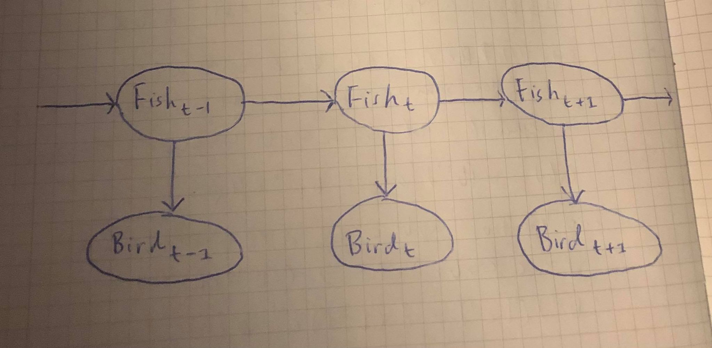

# TDT4171 - Artificial Intelligence Methods
## Assignment 2 - Probabilistic Reasoning over Time
### Problem 1
__a)__ Formulating the problem given in the problem as a hidden Markov model:

**The complete probability tables for the model:**
|$F_{t-1}$|$P(F_t)$|
|---|---|
|$t$|$0.8$|
|$f$|$0.3$|

|$F_t$|$P(B_t)$|
|---|---|
|$t$|$0.75$|
|$f$|$0.2$|

__b)__ Output from [assignment2.py](assignment2.py) after calculating
$$\mathbf{P}\left(X_t|\mathbf{e}_{1:t}\right),\quad\text{for}\quad t=1,\dots,6\tag{1}$$
```{sh}
Problem 1b)
Calculating P(X_t|e_1:t) for t = 1,...,6:
P(X_1|e_1:1) = [0.78947368 0.21052632]
P(X_2|e_1:2) = [0.86538462 0.13461538]
P(X_3|e_1:3) = [0.38399516 0.61600484]
P(X_4|e_1:4) = [0.75213858 0.24786142]
P(X_5|e_1:5) = [0.33260527 0.66739473]
P(X_6|e_1:6) = [0.73400126 0.26599874] 
```
This operation is __filtering__ because we are calculating $\mathbf{P}(X_t|\mathbf{e}_{1:t})$ for every observation in our evidence vector. Filtering gives us the belief state of a rational agent.

__c)__ Output from [assignment2.py](assignment2.py) after calculating
$$\mathbf{P}\left(X_t|\mathbf{e}_{1:6}\right),\quad\text{for}\quad t=7,\dots,30\tag{2}$$
```{sh}
Problem 1c)
Calculating P(X_t|e_1:6) for t = 7,...,30:
P(X_7|e_1:6) = [0.60636421 0.39363579]
P(X_8|e_1:6) = [0.54834737 0.45165263]
P(X_9|e_1:6) = [0.52197608 0.47802392]
P(X_10|e_1:6) = [0.50998913 0.49001087]
P(X_11|e_1:6) = [0.50454051 0.49545949]
P(X_12|e_1:6) = [0.50206387 0.49793613]
P(X_13|e_1:6) = [0.50093812 0.49906188]
P(X_14|e_1:6) = [0.50042642 0.49957358]
P(X_15|e_1:6) = [0.50019383 0.49980617]
P(X_16|e_1:6) = [0.5000881 0.4999119]
P(X_17|e_1:6) = [0.50004005 0.49995995]
P(X_18|e_1:6) = [0.5000182 0.4999818]
P(X_19|e_1:6) = [0.50000827 0.49999173]
P(X_20|e_1:6) = [0.50000376 0.49999624]
P(X_21|e_1:6) = [0.50000171 0.49999829]
P(X_22|e_1:6) = [0.50000078 0.49999922]
P(X_23|e_1:6) = [0.50000035 0.49999965]
P(X_24|e_1:6) = [0.50000016 0.49999984]
P(X_25|e_1:6) = [0.50000007 0.49999993]
P(X_26|e_1:6) = [0.50000003 0.49999997]
P(X_27|e_1:6) = [0.50000002 0.49999998]
P(X_28|e_1:6) = [0.50000001 0.49999999]
P(X_29|e_1:6) = [0.5 0.5]
P(X_30|e_1:6) = [0.5 0.5]
```
This operation is called __prediction__ because we are calculating $\mathbf{P}(X_t|\mathbf{e}_{1:6})$ for $t$'s where we don't have any evidence. Prediction gives us an evaluation of possible action sequences.
As $t$ increases, the distribution converges to $\left[\frac{1}{2},\frac{1}{2}\right].$ In other words,
$$\lim_{t\to\infty}{\mathbf{P}(X_t|\mathbf{e}_{1:6})}=\left[\frac{1}{2},\frac{1}{2}\right],$$
which is the prior probability we started with.

__d)__ Output from [assignment2.py](assignment2.py) after calculating
$$\mathbf{P}\left(X_t|\mathbf{e}_{1:6}\right),\quad\text{for}\quad t=0,\dots,5\tag{3}$$
```{sh}
Problem 1d)
Calculating P(X_t|e_1:6) for t = 0,...,5:
P(X_5|e_1:6) = [0.33260527 0.66739473]
P(X_4|e_1:6) = [0.65125107 0.34874893]
P(X_3|e_1:6) = [0.47270934 0.52729066]
P(X_2|e_1:6) = [0.81934685 0.18065315]
P(X_1|e_1:6) = [0.85043729 0.14956271]
P(X_0|e_1:6) = [0.65928968 0.34071032] 
```
This operation is called __smoothing__ because we are calculating $\mathbf{P}(X_t|\mathbf{e}_{1:6})$ for past $t$'s. Smoothing gives us better estimates of past states.

__e)__ Output from [assignment2.py](assignment2.py) after calculating
$$\argmax_{x_1,\dots,x_{t-1}}\mathbf{P}\left(x_1,\dots,x_{t-1},X_t|\mathbf{e}_{1:t}\right),\quad\text{for}\quad t=1,\dots,6\tag{4}$$
```
Problem 1e)
Calculating P(x_1,...,x_(t-1),X_t|e_1:t) for t = 1,...,6:
m_1:1 = [0.78947368 0.21052632] --> True
m_1:2 = [0.47368421 0.04736842] --> True
m_1:3 = [0.09473684 0.11368421] --> False
m_1:4 = [0.05684211 0.01818947] --> True
m_1:5 = [0.01136842 0.01364211] --> False
m_1:6 = [0.00682105 0.00218274] --> True 
```
Here $m_{1:t}(i)$ gives the probability of the **most likely sequence** to state $i$. The most likely sequence is ...