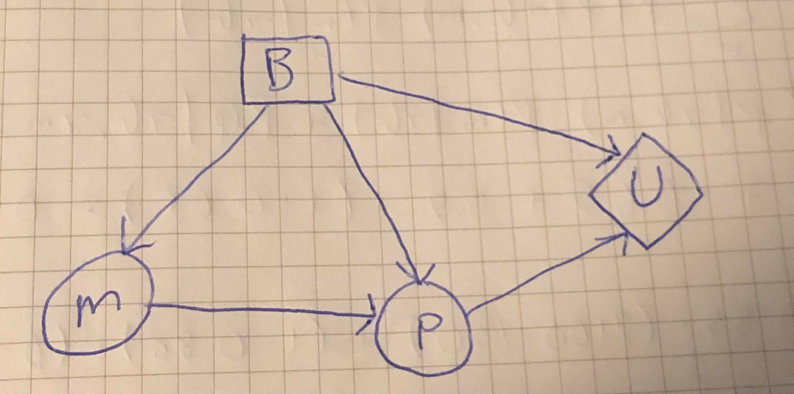

# TDT4171 - Artificial Intelligence Methods
## Assignment 3 - Making Decisions
### Problem 1
__a)__ The decision network for this problem:

Since $P$ is not independent of $B$ given $M$, we draw an edge from $M$ to $P$. We also draw edges from $B$ to $M$ and $P$ because buying the book _can_ make student master the course or pass the course with some probabilites given in the problem text. Furthermore, we draw edges from $B$ and $P$ to the utility node $U$ since the two utility functions, $U_1$ and $U_2$, depend on buying the book, and passing the test.

__b)__ Using the decision network, we get the following expressions for the expected utility of $B=true$ and $B=false$:
$$\begin{aligned}
\mathbb{E}U(b)&=\sum_{p}{P(p|b)\cdot U(b, p)}\\
\mathbb{E}U(\neg b)&=\sum_{p}{P(p|\neg b)\cdot U(\neg b, p)},
\end{aligned}$$
where $b$ and $p$ are the realizations of $B$ and $P$, respectively, and $U(b, p)=U_1(b)+U_2(p)$. We are using $P(p|b)$ here because the result of buying/not buying the book is passing/not passing the course.

Let's calculate $P(p|b)$ and $P(p|\neg b)$ using the topology of the decision network:
$$\begin{aligned}
P(p|b)&=\sum_{m}{P(p|b,m)\cdot P(m|b)}\\
&=P(p|b,m)\cdot P(m|b)+P(p|b,\neg m)\cdot P(\neg m|b)\\
&=0.9\cdot0.9+0.4\cdot(1-0.9)=0.85\\
P(p|\neg b)&=\sum_{m}{P(p|\neg b,m)\cdot P(m|\neg b)}\\
&=P(p|\neg b,m)\cdot P(m|\neg b)+P(p|\neg b,\neg m)\cdot P(\neg m|\neg b)\\
&=0.7\cdot0.65+0.2\cdot(1-0.65)=0.525
\end{aligned}$$
Finding the expected utilities:
$$\begin{aligned}
\mathbb{E}U(b)&=\sum_{p}{P(p|b)\cdot U(b, p)}\\
&=P(p|b)\cdot U(b, p)+P(\neg p|b)\cdot U(b, \neg p)\\
&=0.85\cdot(-150+2100)+(1-0.85)\cdot(-150+0)=\underline{\underline{1635}}\\
\mathbb{E}U(\neg b)&=\sum_{p}{P(p|\neg b)\cdot U(\neg b, p)}\\
&=P(p|\neg b)\cdot U(\neg b, p)+P(\neg p|\neg b)\cdot U(\neg b, \neg p)\\
&=0.525\cdot(0+2100)+(1-0.525)\cdot(0+0)=\underline{\underline{1102.5}}\\
\end{aligned}$$
Since $\mathbb{E}U(b)>\mathbb{E}U(\neg b)$, the MEU principle tells us that Geir should buy the book.