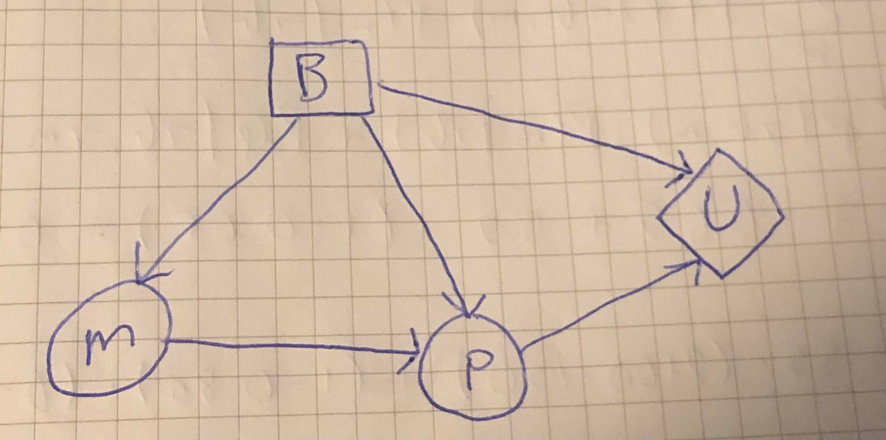
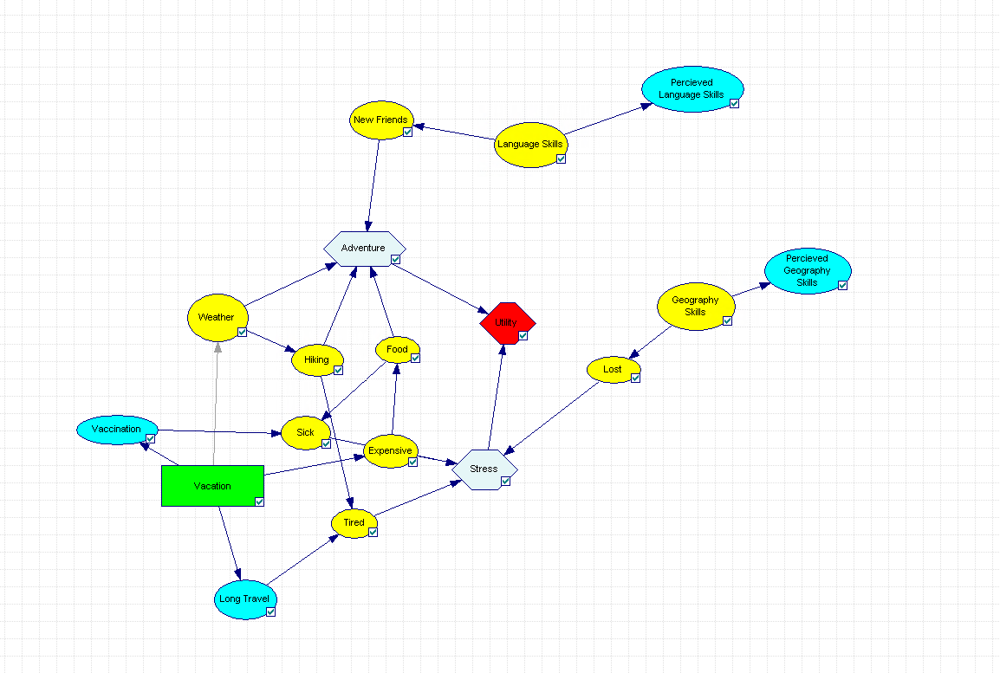
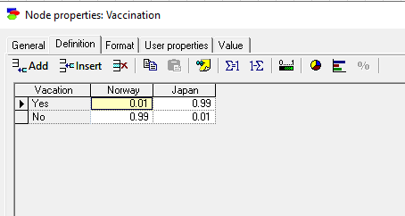
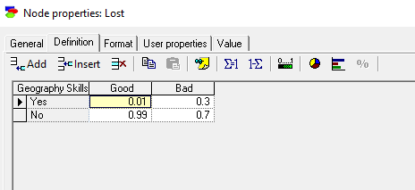
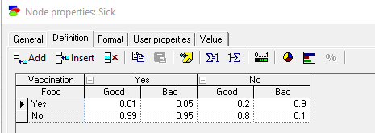
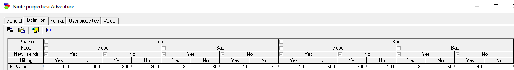
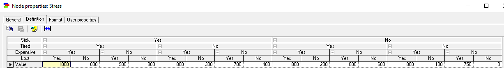
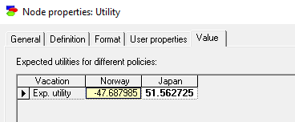

# TDT4171 - Artificial Intelligence Methods
## Assignment 3 - Making Decisions
### Problem 1
__a)__ The decision network for this problem:

Since $P$ is not independent of $B$ given $M$, we draw an edge from $M$ to $P$. We also draw edges from $B$ to $M$ and $P$ because buying the book _can_ make student master the course or pass the course with some probabilites given in the problem text. Furthermore, we draw edges from $B$ and $P$ to the utility node $U$ since the two utility functions, $U_1$ and $U_2$, depend on buying the book, and passing the test.

__b)__ Using the decision network, we get the following expressions for the expected utility of $B=true$ and $B=false$:
$$\begin{aligned}
\mathbb{E}U(b)&=\sum_{p}{P(p|b)\cdot U(b, p)}\\
\mathbb{E}U(\neg b)&=\sum_{p}{P(p|\neg b)\cdot U(\neg b, p)},
\end{aligned}$$
where $b$ and $p$ are the realizations of $B$ and $P$, respectively, and $U(b, p)=U_1(b)+U_2(p)$. We are using $P(p|b)$ here because the result of buying/not buying the book is passing/not passing the course.

Let's calculate $P(p|b)$ and $P(p|\neg b)$ using the topology of the decision network:
$$\begin{aligned}
P(p|b)&=\sum_{m}{P(p|b,m)\cdot P(m|b)}\\
&=P(p|b,m)\cdot P(m|b)+P(p|b,\neg m)\cdot P(\neg m|b)\\
&=0.9\cdot0.9+0.4\cdot(1-0.9)=0.85\\
P(p|\neg b)&=\sum_{m}{P(p|\neg b,m)\cdot P(m|\neg b)}\\
&=P(p|\neg b,m)\cdot P(m|\neg b)+P(p|\neg b,\neg m)\cdot P(\neg m|\neg b)\\
&=0.7\cdot0.65+0.2\cdot(1-0.65)=0.525
\end{aligned}$$
Finding the expected utilities:
$$\begin{aligned}
\mathbb{E}U(b)&=\sum_{p}{P(p|b)\cdot U(b, p)}\\
&=P(p|b)\cdot U(b, p)+P(\neg p|b)\cdot U(b, \neg p)\\
&=0.85\cdot(-150+2100)+(1-0.85)\cdot(-150+0)=\underline{\underline{1635}}\\
\mathbb{E}U(\neg b)&=\sum_{p}{P(p|\neg b)\cdot U(\neg b, p)}\\
&=P(p|\neg b)\cdot U(\neg b, p)+P(\neg p|\neg b)\cdot U(\neg b, \neg p)\\
&=0.525\cdot(0+2100)+(1-0.525)\cdot(0+0)=\underline{\underline{1102.5}}\\
\end{aligned}$$
Since $\mathbb{E}U(b)>\mathbb{E}U(\neg b)$, the MEU principle tells us that Geir should buy the book.
### Problem 2
#### The decision problem
The decision problem I have decided to model in this exercise is the problem of choosing a destination for my next summer holiday. More specifically, should I stay travel in Norway, a country where I have lived all my life and know very well. Or should I travel to Japan, a country which is very different from Norway, both in terms of language, geography, culture etc. In this problem, I assume that the pandemic is over. I also have knowledge about whether I am vaccinated before I travel, and my percieved geography and language skills of Japan.
#### Creating a casual model
I have decided to model this problem as a Bayesian network, because we have many random variables which are dependent on each other. To clarify, this model will be non-dynamic, as it is not possible to "regret" on the trip and travel back to Norway. Hence, we only have to make one decision. 

I have decided to present this model as a decision network, which is shown further down in the document. The causal model consists of the following components:
* A decision node
* Utility nodes
* Variables, both certain and uncertain

I will now present these nodes:
##### Decision node
The decision node **Vacation** in the decision network is a binary decision node. In other words, I can make two decisions here. Have a holiday in Norway, or travel to Japan. We have some variables which are dependent on the decision I make. Those are:
* **Vaccination:** This is a certain variable, because I would vaccinate myself before travelling to another country in the world.
* **Long Travel:** This is a certain variable, since travelling to Japan implies a long tavel, but it isn't the case if I stay in Norway. By **Long Travel**, I mean travelling where you need to use a plane.
* **Expensive:** This is an uncertain variable, since I don't know how expensive the trip to Japan is going to be before I have travelled there. The same is also true for Norway, as I don't know how expensive it will be if I stay.
* **Weather:** This is also an uncertain variable, as I can't see into the future and how the weather is going to be in Japan or Norway. It can only be known after I have taken a decision.

##### Utility nodes
I have decided to model the utility function as an additive linear utility function. Let $U_1$ be the utility function for _Adventure_, and let $U_2$ be the utility function for _Stress_. Then I have defined my utility function $U$ as
$$U=U_1-U_2=\text{Adventure}-\text{Stress}.\tag{1}$$
$U_1$ is dependent on **the food**, **hiking**, **making new friends**, and **the weather**. These variables have a directed edge to this utility node. These may not be the most "adventurous activities", but given how I am as a person, these things constitute an adventurous vacation for me.

$U_2$ is dependent on **me being lost**, **getting sick**, **expenses** and **getting tired**. These variables have a directed edge to this utility node. These are some of the things that make me stressed when I am on a vacation.

##### Variables
I have already described some of the certain and uncertain variables in the decision network, but here I will give a more detailed description of the variables and the causalities between them:
* **Sick:** This is an uncertain variable, and is dependent on me being vaccinated and the food I am eating when I am on vacation.
* **Tired:** This is dependent on how long the travel is, and if I decide to hike if I am on my vacation.
* **Food:** The quality of the food is dependent on how expensive the food is.
* **Hiking:** This variable is dependent on the weather.
* **New Friends** and **Perceived language skills** are dependent on the **language skills** variable. The ability to make new friends in a different country is much easier if you know the local language, but it is not an important requirement. My percieved language skills is a certain variable.
* **New Friends** and **Perceived language skills** are dependent on the **language skills** variable. The ability to make new friends in a different country is much easier if you know the local language, but it is not an important requirement. My percieved language skills is a certain variable.
* **Lost** and **Perceived geography skills** are dependent on the **geography skills** variable. Me getting lost depends on how well I know the geography of the country/city I am in. My percieved language skills is a certain variable.

In total, we have 4 certain variables, and 10 uncertain variables. The certain variables act as windows into these uncertain variables. 
We get the following decision network:

The green node is the decision node, the light blue nodes are the certain variables, the yellow nodes are the uncertain variables. The grey nodes are the utility functions, and the red node is the additive utility function.

#### Assignining probabilites
Now I will present some of the CPTs in the decision network. Before presenting these probabilites, I must say that the probabilities are a simplifed version of the real world, and are based on my experiences when travelling. 

As I mentioned earlier, I would vaccinate myself before travelling to another country. It is very unlikely that I would travel without a vaccine, but it is not impossible. Therefore, I have not set the probability to zero, since one can never condition away a zero probability, even if you have a lot of evidence.

Further, one can also get lost when travelling to a new place. It really depends on where you are travelling, but I believe that when you are a tourist you will probably not be wandering in places where there are no people to guide you if you get lost. Therefore I have not given the probability of getting lost given bad geography skills a very low value:

I believe that the two main sources for getting sick while travelling is when you don't have a travel vaccine, or if you have eaten food of low quality. There are of course a lot of other factors which decide if you get sick or not, but I have not included them in my relatively simple decision network.

#### Assigning utilities
As mentioned above, the utility node (the red one) is an additive linear utility node, given by equation $(1)$. I would describe myself as a risk adhesive person, and I am not particulary fond of stressful situations. Therefore, I have given the utitiles for the **Stress** node higher values than the **Adventure** node. 

As we can see on the tables above, I have given the utilities for **Stress** higher values in general compared to the **Adventure** utility node. I weight my safety and comfort way higher than having fun, and this will probably reflect my decision.

#### Verification and refinement
After updating the model, I get the following expected utilities:

In other words, I should travel to Japan for my vacation. I expected this result given even though I have weighted the **Stress** utility higher than the **Adventure** utility. But the probability of for example getting lost or getting sick, given that I have taken a vaccine and studied the map are relatively low. To refine the model, I could have made the probabilities more realistic, by for example looking at statistics related to travelling, instead of defining the probabilities based on my gut feeling.

Again, this is a relatively simple model compared to the real world, and a lot of the probabilites have been heavily discretized.