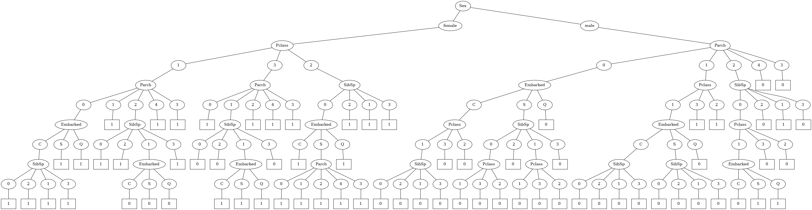
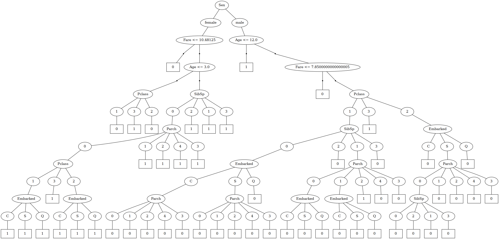

# TDT4171 - Artificial Intelligence Methods
## Assignment 4 - Decision Trees
### Problem 1 - Decision Trees
__a)__ See [assignment4.py](assignment4.py) for the implementation of the decision tree. I decided to drop the columns `Name`, `Ticket` and `Cabin`, since the cabin name of the passenger, the ticket number, and the cabin number do not reflect the likelihood of surviving. These columns are also strings, and may be difficult to categorize as either categorical or continious variables. I also dropped rows where we had missing values. The categorical variables I trained the model on were:
* `Pclass`
* `Sex`
* `SibSp`
* `Parch`
* `Embarked`

One could argue that `SibSp` and `Parch` are continious variables, but these variables only have 4 discrete values, and since I consider `Pclass` as a categorical variable, it is natural that I also consider these variables as categorical.

Thus, the continious variables in the dataset are:
* `Age`
* `Fare`

After fitting my decision tree to the training data, I got a test accuracy of 92.7710843373494 %

Here is a visualization of the decision tree:

__b)__ See [assignment4.py](assignment4.py) for the implementation of the decision tree. After fitting my decision tree to the training data, I got a test accuracy of 93.97590361445783 %

Here is a visualization of the decision tree:

__c)__ The performance of the two models is almost the same. This can happen because the predictors used to train the model with only categorical variables may explain most of the variance in the dataset. 

Here are some changes for how we could improve the dataset:
* Extract information from the columns I dropped. For example, the `Name` columns includes the title of each person, for example `Mr.`, `Mrs.`, `Dr.`, `Prof.` and so on. These can reflect the probability of surviving.
* We can also make new features out of the current features. For example, combining `Pclass` and `Age` to see how age and your ticket class together determine your chances of surviving.
* Use PCA (Principal Component Analysis) to remove features which explain little variability in the data.
* Use some of the techniques discussed in __Problem 2__ to fill in missing values. These may have important information to make the model better.
* This may not improve performance, but one can also use pruning to remove redundant or non-important parts of the decision tree to make the model more _interpretable_.