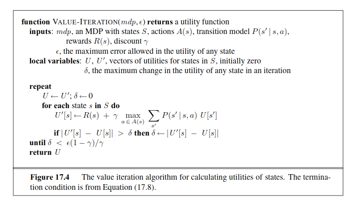
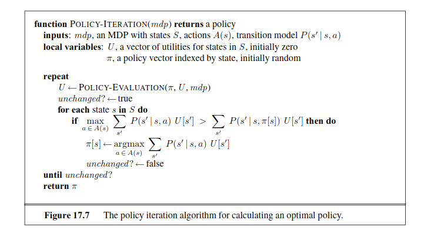
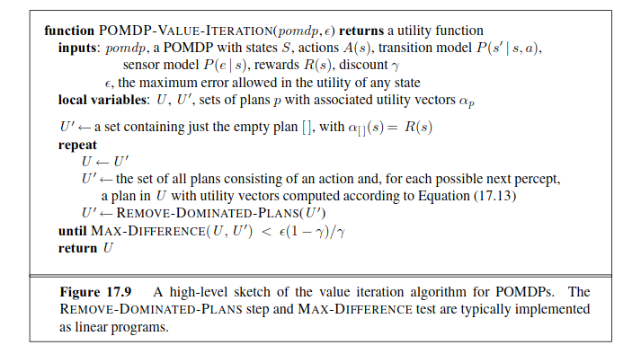

# Chapter 17 - Making Complex Decisions
_In which we examine methods for deciding what to do today, given that we may decide again tomorrow._
## Utilities over time
With discounted rewards, the utility of an infinite sequence is _finite._ In fact, it $\gamma<1$ and rewards are bounded by $\pm R_{\max},$ we have
$$U_h([s_0,s_1,s_2,\dots])=\sum_{t=0}^\infty{\gamma^tR(s_t)}\leq\sum_{t=0}^\infty{\gamma^tR_{\max}}=R_{\max}/(1-\gamma),\tag{17.1}$$
using the standard formula for the sum of an infinite geometric series.
## Optimal policies and the utilities of states
The expected utility obtained by executing $\pi$ starting in $s$ is given by
$$U^{\pi}(s)=E\left[\sum_{t=0}^\infty{\gamma^tR(S_t)}\right],\tag{17.2}$$
where the expectation is with respect to the probability distribution over state sequences determined by $s$ and $\pi.$ Now, out of all the policies the agent could choose to execute starting in $s,$ one (or more) will have higher expected utilities than all the others. We'll use $\pi_s^*$ to denote one of these policies:
$$\pi_s^*=\argmax_{\pi}U^\pi(s).\tag{17.3}$$
The utility function $U(s)$ allows the agent to select actions by using the principle of maximum expected utility from Chapter $16$ - that is, choose the action that maximimizes the expected utility of the subsequent state:
$$\pi^*(s)=\argmax_{a\in A(s)}{\sum_{s'}{P(s'|s,a)U(s')}}.\tag{17.4}$$
## The Bellman equation for utilities
$$U(s)=R(s)+\gamma\max_{a\in A(s)}{\sum_{s'}{P(s'|s,a)U(s')}}.\tag{17.5}$$
## The value iteration algorithm
The iteration step, called a __Bellman update,__ looks like this:
$$U_{i+1}(s)\leftarrow R(s)+\gamma\max_{a\in A(s)}{\sum_{s'}{P(s'|s,a)U_i(s')}},\tag{17.6}$$
where the update is assumed to be applied simultaneously to all the states at each iteration.

## Convergence of value iteration
The main result of this section is the following: _Let $U_i$ and $U_i'$ be any two utility vectors. Then we have_
$$||BU_i-BU_i'||\leq\gamma||U_i-U_i'||.\tag{17.7}$$
From the contraction property (Equation $(17.7)$), it can be shown that if the update is small (i.e., no state's utility changes by much), then the error, compared with the true utility function, also is small. More precisely,
$$\text{if}\quad||U_{i+1}-U_i||<\epsilon(1-\gamma)/\gamma\quad\text{then}\quad||U_{i+1+}-U_i||<\epsilon.\tag{17.8}$$
## Policy Loss
THe policy loss of $\pi_i$ is connected to the error in $U_i$ by the following inequality:
$$\text{if}\quad||U_i-U||<\epsilon\quad\text{then}\quad||U^{\pi_i}-U||<2\epsilon\gamma/(1-\gamma).\tag{17.9}$$
## Policy Iteration
We have a simplified version of the Bellman equation $(17.5)$ relating the utility of $s$ (under $\pi_i$) to the utilities of its neighbors:
$$U_i(s)=R(s)+\gamma\sum_{s'}{P(s'|s,\pi_i(s))U_i(s')}.\tag{17.10}$$

## Partially Observable MDPs
If $b(s)$ was the previous belief state, and the agent does action $a$ and then perceives evidence $e,$ then the new belief state is given by
$$b'(s')=\alpha P(e|s')\sum_s{P(s'|s,a)b(s)},$$
where $\alpha$ is a normalizing constant that makes the belief state sum to $1.$ By analogy with the update operator for filtering (page $572$), we can write this as
$$b'=\text{FORWARD}(b,a,e).\tag{17.11}$$
Let's write the probability of reaching $b'$ from $b,$ given action $a,$ as $P(b'|b,a).$ Then that gives us
$$\begin{aligned}
P(b'|b,a)&=P(b'|a,b)=\sum_e{P(b'|e,a,b)P(e|a,b)}\\
&=\sum_e{P(b'|e,a,b)\sum_{s'}P(e|s')\sum_s{P(s'|s,a)b(s)}},
\end{aligned}\tag{17.12}$$
where $P(b'|e,a,b)$ is $1$ if $b'=\text{FORWARD}(b,a,e)$ and $0$ otherwise.
## Value iteration for POMDPs
In general, let $p$ be a depth-$d$ conditional plan whose initial action is $a$ and whose depth-$d$ - 1 subplan for percept $e$is $p.e;$ then
$$\alpha_p(s)=R(s)+\gamma\left(\sum_{s'}P(s'|s,a)\sum_e{P(e|s')\alpha_{p.e}(s')}\right).\tag{17.13}$$

## Summary
This chapter shows how to use knowledge about the world to make decisions even when the outcomes of an action are uncertain and the rewards for acting might not be reaped until many actions have passed. The main points are as follows:
* Sequential decision problems in uncertain environments, also called __Markov decision processes,__ or MDPs, are defined by a __transition model__ specifying the probablistic outcomes of actions and a __reward function__ specifying the reward in each state.
* The utility of a state sequence is the sum of all the rewards over the sequence, possibly discounted over time. The solution of an MDP is a __policy__ that associates a decision with every state that the agent might reach. An optimal policy maximizes the utility of the state sequences encountered when it is executed.
* The utility of a state is the expected utility of the state sequences encountered when an optimal policy is executed, starting in that state. The __value iteration__ algorithm for solving MDP's works iteratively solving the equations relating the utility of each state to those of its neighbors.
* __Policy iteration__ alternates between calculating the utilities of states under the current policy and improving the current policy with respect to the current utilities.
* Partially observable MDPs, or POMDPs, are much more difficult to solve than MDPs. They can be solved by conversion to an MDP in the continious space of belief states; both value iteration and policy iteration algorithms have been devised. Optimal behavior in POMDPs includes information gathering to reduce uncertainty and therefore make better decisions in the future.
* A decision-theoretic agent can be constructed for POMDP environments. The agent uses a __dynamic decision network__ to represent the transition and sensor models, to update its belief state, and to project forward possible action sequences.