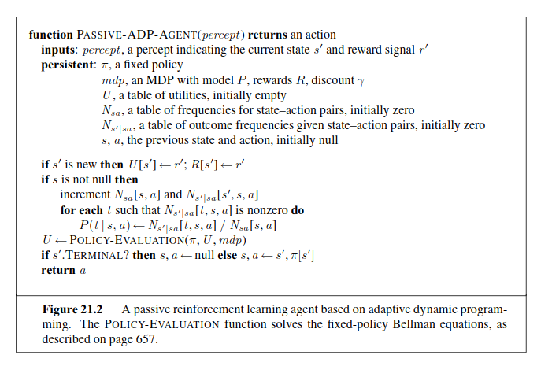
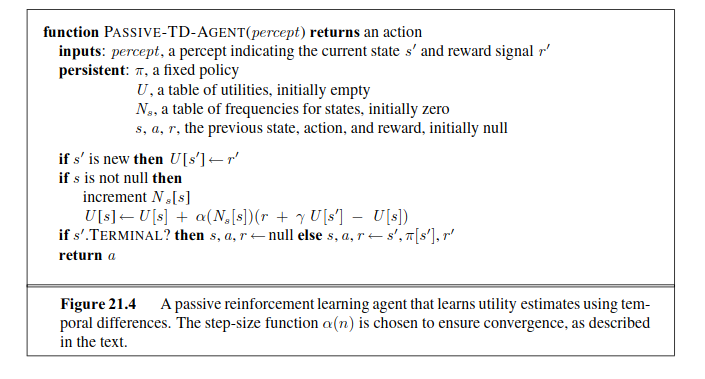
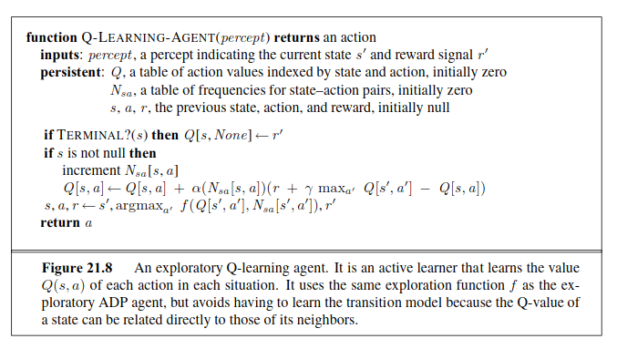

# Chapter 21 - Reinforcement Learning
_In which we examine how an agent can learn from success and failure, from reward and punishment._
## Passive Reinforcement Learning
The utility is defined to the expectd sum of (discounted) rewards obtained if policy $\pi$ is followd. As in Equation $(17.2)$ on page $650,$ we write
$$U^{\pi}(s)=E\left[\sum_{t=0}^\infty{\gamma^tR(S_t)}\right]\tag{21.1}$$
where $R(s)$ is the reward for a state, $S_t$ (a random variable) is the state reached at time $t$ when executing policy $\pi,$ and $S_0=s.$
### Direct utility estimation
_The utility of each state equals its own reward plus the expected utility of its successor states._ That is, the utility values obey the Bellman equations for a fixed policy (see also Equation $(17.10)$):
$$U^\pi(s)=R(s)+\gamma\sum_{s'}{P(s'|s,\pi(s))U^\pi(s')}.\tag{21.2}$$
### Adaptive dynamic programming

### Temporal-difference learning
When a transition occurs from state $s$ to state $s',$ we apply the following update to $U^\pi(s):$
$$U^\pi(s)\leftarrow U^\pi(s)+\alpha(R(s)+\gamma U^\pi(s')-U^\pi(s)).\tag{21.3}$$

## Active Reinforcement Learning
The utilities it needs to learn are those defined by the _optimal_ policy; they obey the Bellman equations given on page $652:$
$$U(s)=R(s)+\gamma\max_a{\sum_{s'}{P(s'|s,a)U(s')}}.\tag{21.4}$$
### Exploration
Suppose we are using value iteration in an ADP learning agent; then we need to rewrite the update equation (Equation $(17.6)$ on page $652$) to incorporate the optimistic estimate. The following equation does this:
$$U^+(s)=R(s)+\gamma\max_a{f\left(\sum_{s'}{P(s'|s,a)U^+(s'), N(s,a)}\right)}.\tag{21.5}$$
### Learning an action-utility function
There is an alternative TD method, called __Q-learning__ which learns an action-utility representation instead of learning utilities. We will use $Q(s,a)$ to denote the value of doing action $a$ in state $s.$ Q-values are directly related to utility values as follows:
$$U(s)=\max_a{Q(s,a)}.\tag{21.6}$$
As with utilities, we can write a constraint equation that must hold at equilibrium when the Q-values are correct:
$$Q(s,a)=R(s)+\gamma\sum_{s'}{P(s'|s,a)\max_{a'}Q(s',a')}.\tag{21.7}$$

The update equation for TD Q-learning is
$$Q(s,a)\leftarrow Q(s,a)+\alpha(R(s)+\gamma\max_{a'}{Q(s',a')-Q(s,a)}),\tag{21.8}$$
which is calculated whenever action $a$ is executed in state $s$ leading to $s'.$

Q-learning has a close relative called __SARSA__ (for State-Action-Reward-State-Action). The update rule for SARSA is vary similar to Equation $(21.8):$
$$Q(s,a)\leftarrow Q(s,a)+\alpha(R(s)+\gamma Q(s',a')-Q(s,a)),\tag{21.9}$$
where $a'$ is the action _actually taken_ in state $s'.$